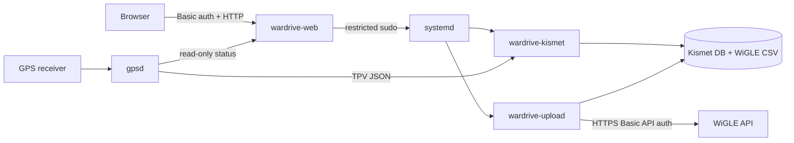

# Architecture

## Assumptions

- Raspberry Pi OS uses systemd and Debian packages.
- A dedicated adapter supports monitor mode; Kismet manages monitor mode.
- The dashboard is used on a trusted LAN but is still password protected.
- Capture volume is small enough for local storage and manual uploads.

## Components and data flow

`wardrive-web` runs as an unprivileged user. Its sudo policy permits only
start/stop of `wardrive-kismet.service` and start of
`wardrive-upload.service`. The upload worker runs separately as root because
only root can read `/etc/wardrive/wigle.env`.

## HTTP API

All routes require HTTP Basic authentication.

| Method | Path | Purpose |
|---|---|---|
| `GET` | `/` | Dashboard |
| `GET` | `/api/status` | Service, GPS, capture, and upload status |
| `POST` | `/api/kismet/start` | Start capture |
| `POST` | `/api/kismet/stop` | Stop capture |
| `POST` | `/api/upload` | Queue the one-shot upload unit |

Mutating routes also require the per-process `X-CSRF-Token` placed into the
dashboard page. Responses are JSON.

## Reliability and security

- systemd restarts the dashboard and Kismet after unexpected failures.
- The uploader retries transient network failures with exponential backoff.
- `.uploaded` marker files make uploads repeat-safe.
- WiGLE credentials and the dashboard password hash are root-owned.
- The dashboard binds to all interfaces by default. Firewalling or a reverse
  proxy with TLS is recommended on untrusted networks.
- Kismet's own web UI remains bound to localhost; this project exposes only
  the narrow control/status dashboard.

## Future growth

For a fleet, replace local credential files and manual upload controls with a
secret manager, central job queue, device identity, TLS, and remote health
monitoring. Large capture volumes should use retention policies and encrypted
storage.

