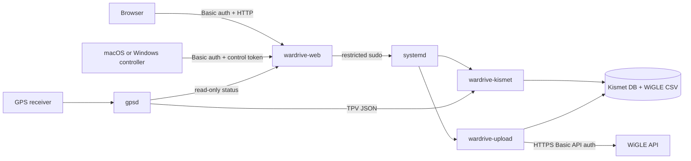

# Architecture

## Assumptions

- Raspberry Pi OS uses systemd and Debian packages.
- A dedicated adapter supports monitor mode; Kismet manages monitor mode.
- The dashboard is used on a trusted LAN but is still password protected.
- Capture volume is small enough for local storage and manual uploads.

## Components and data flow

`wardrive-web` runs as an unprivileged user. Its sudo policy permits only the
exact Kismet, GPSD, Avahi, and upload commands exposed by the API. No service
name or command supplied by a client is passed to the shell. The upload worker
runs separately as root because only root can read `/etc/wardrive/wigle.env`.
The web service remains status-only for itself so a remote controller cannot
disconnect its own control channel.

## HTTP API

All routes require HTTP Basic authentication.

| Method | Path | Purpose |
|---|---|---|
| `GET` | `/` | Dashboard |
| `GET` | `/api/session` | Obtain the control token for an authenticated client |
| `GET` | `/api/status` | Service, GPS, capture, and upload status |
| `GET` | `/api/files` | Capture file metadata |
| `POST` | `/api/kismet/start` | Start capture |
| `POST` | `/api/kismet/stop` | Stop capture |
| `POST` | `/api/kismet/restart` | Restart capture |
| `POST` | `/api/kismet/force-stop` | Immediately kill and stop capture |
| `POST` | `/api/gpsd/{start,stop,restart}` | Control the GPSD service and socket |
| `POST` | `/api/avahi/{start,stop,restart}` | Control mDNS discovery |
| `POST` | `/api/upload` | Queue the one-shot upload unit |

Mutating routes also require the per-process `X-CSRF-Token` available from the
authenticated session endpoint and embedded into the dashboard page. Responses
are JSON. File APIs return metadata only and do not expose file contents or
accept client-provided paths.

## Reliability and security

- systemd restarts the dashboard and Kismet after unexpected failures.
- The uploader retries transient network failures with exponential backoff.
- `.uploaded` marker files make uploads repeat-safe.
- WiGLE credentials and the dashboard password hash are root-owned.
- The dashboard binds to all interfaces by default. Firewalling or a reverse
  proxy with TLS is recommended on untrusted networks.
- Kismet's own web UI remains bound to localhost; this project exposes only
  the narrow control/status dashboard.
- The Tkinter desktop controller has no third-party dependencies and stores
  dashboard credentials only in process memory.

## Future growth

For a fleet, replace HTTP Basic authentication and local credential files with
device identity, TLS, a secret manager, a central job queue, and remote health
monitoring. Large capture volumes should use pagination, retention policies,
and encrypted storage.
